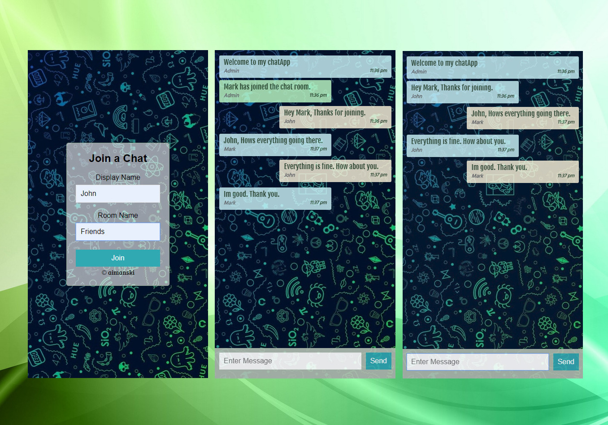

# Chat App

This is a basic chat app I created using Socket.io. A javascript client library for the browser. It it is real-time bi-directional event-based communication.

# The App looks like this;

# JS libraries used

* [ExpressJS](https://github.com/expressjs/express). 
* [Moment](https://www.npmjs.com/package/moment). 
* [Socket.io](https://www.npmjs.com/package/socket.io). 
* [Nodemon](https://www.npmjs.com/package/nodemon). 
* [Expect](https://github.com/mjackson/expect). 

# What I Learned from this project;

* Set-up an basic express server.
* How to attach socket.io to a running NodeJS HTTP server and establish a bi-directional and event based connection to transmit meta-data between connected clients.
* Abstract time using momentjs. 
* Validate the output data if it matches the expected data type using Expect.

